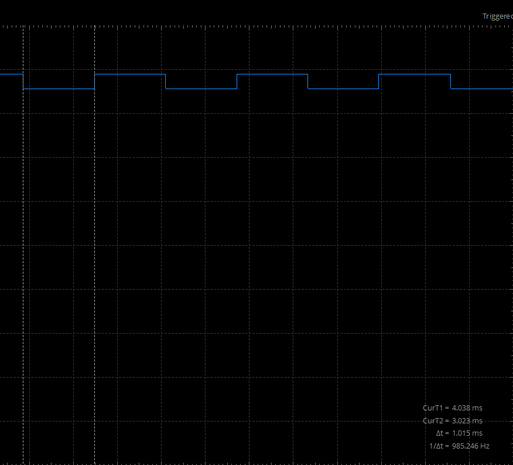
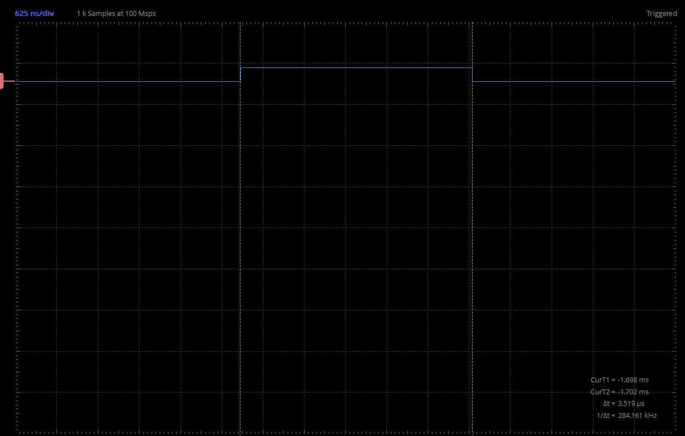
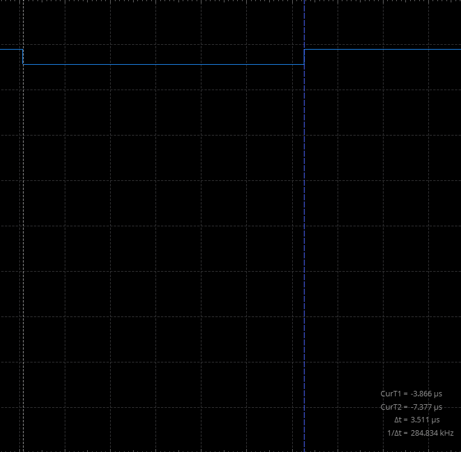
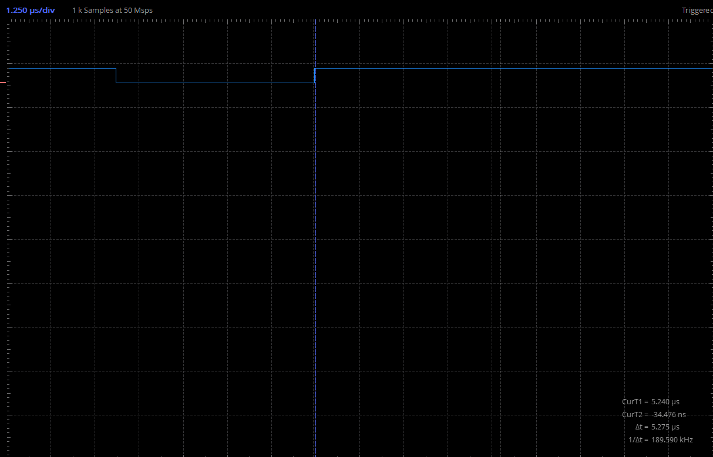
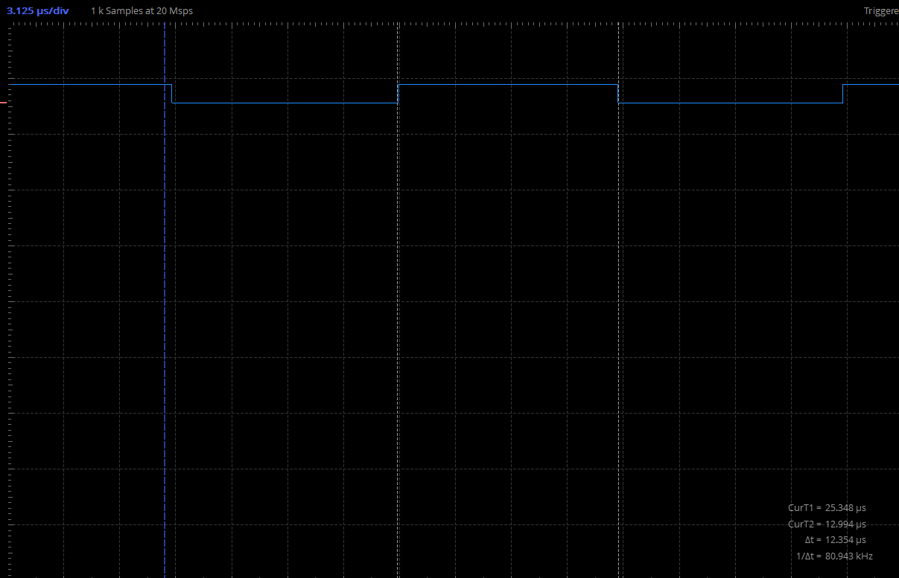

# Project 3: Measuring minimum delay in Arduino using the ADALM2000 logic analyzer

1. Understand the use of variables in code
2. Learn how to use a logic analyzer
3. Understand the concept of overhead and measure it

## resources
[Arduino Functions Reference](https://www.arduino.cc/reference/en/)

## Change Blink.ino code
 - Save Blink example as BlinkWithVariableDelay.ino in this folder
 - Use a variable to change built in led (13) to grove led (4)
 - Use a variable to change delay to 1 ms 
 - upload to arduino
 - can you see the led blink? Why? No, it's too fast. 
 

## Use logic analyzer to see and measure the blink
 - connect ADALM2000 to grove kit: 
    - gnd in ADALM to GND in arduino (black color is used as a standard for GND)
    - digital pin 0 (solid pink) to pin13 in arduino (why?)
 - open scopy program
 - connect to ADALM2000
 - open scopy logic analyzer
 - activate DIO0 and rising edge and run (why?)
 - play with the scopy parameters until you can see the separate blinks. Which parameter(s) do you need to change?
 - use cursors and sample rate to measure the pulse width
 - take screenshots and add them to the README below.
 

## Measure overhead
 - Remove the delay statements and upload the code
 - Measure pulse width. What is the minimum time that the signal is HIGH and LOW? this is the overhead.3.519 microsecond
 - Take screenshots and add them to the README below.
 
 

## even shorter blink
- delay() is limited to 1 ms. Find a function that delays 1 microsecond. 
 - Try different delays and measure the overhead.
 - Take screenshots and add them to the README below.
 1 microsecond - 3.511 microsecond overhead
 3 microsecond - 5.275 microsecond overhead! 
 10 microsecond - 12.354 microsecond overhead 

## Git
 - Commit the new README with your screenshots
 - push to your repo.

## Exercise
Paste screenshots below.

