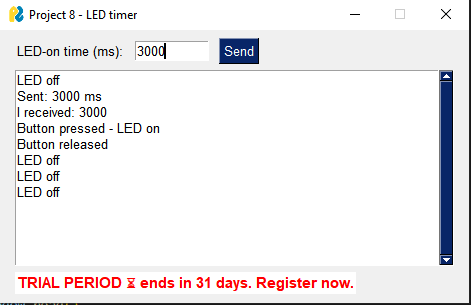
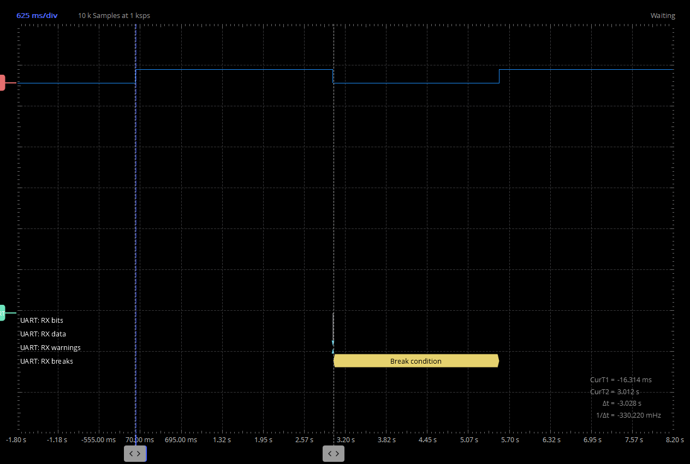

# Project8 - Two way communication between the computer and the Arduino board

1. Methods of communication between the computer and the Arduino board
    - Serial communication
2. Building a simple user interface in python to control the Arduino board
3. Understand the problem of bouncing in buttons and how to write a simple debouncing algorithm

## mini project 1: control how long a LED will light when pressing a button on the arduino side. The ON time is configured by user interface in the computer side##

**Requirements - Arduino side**

1. Develop an Arduino sketch (C++ code) that interacts with a device over a serial port.
2. The sketch should continuously monitor the serial port for incoming data.
3. When data is available, the sketch should read a number of unknown length from the serial port. **There are two main options: you can send a newline at the end of hte number and arduino waits for the new line. This means that also your python code will have to add a newline to its command. Alternatively, the number will not be terminated by a specific character, so configure the serial monitor accordingly**. 
This number is the time in milliseconds that the LED on the device should light up when a button is pressed.
4. After reading the number, the sketch should print a message to the serial port stating "I received: " followed by the number.
5. The sketch should then use the received number to set a timer using the MsTimer2 library. The timer should be set to the received number plus one ms (if this bug was seen in project6).
5. use interrupt to catch the state change of the button, and use the MsTimer2 library for the timer functions.
6. When the timer expires, a function named `turn_off` should be executed.
7. The sketch should handle any exceptions or errors that might occur during the communication with the device.
8. The sketch should include comments explaining the functionality of each part of the code.
9. The sketch should be written in a clean code following good programming practices.

## Python environments
Before using Python, set up the environment. In the course we use Conda, another option is to use `.venv`.
To set up conda using the Anaconda Prompt:
```
conda config --set ssl_verify false
conda create --name intro python=3.11
conda activate intro
```
And after that you can install packages using 
`pip install <package-name>`

In VSCode, chosse the interpreter in `intro` environment of folder.

**Requirements: Python side**

1. Develop a Python script that communicates with a device (like an Arduino) via a serial port.
2. The script should have a GUI (Graphical User Interface) using freesimplegui library. The GUI should have a response area to display messages.
3. The script should be able to send a number over the serial port to the device. This number will be the time in milliseconds that the LED on the device should light up when a button is pressed. (add newline if necessary)
    - For example, if the user enters '5000' in the GUI, the LED on the device should light up for 5 seconds when the button is pressed.
4. Update the arduino code: The device should send a number (0, 1, or 2) that corresponds to a specific state:
    - '0': LED off
    - '1': button and LED on
    - '2': button off
5. The script should read the response from the device and update the GUI with the corresponding message.
6. The script should continuously read from the serial port in parallel with the freesimplegui main loop.
7. The script should handle any exceptions or errors that might occur during the communication with the device.
8. The script should include comments explaining the functionality of each part of the code.
9. The script should be written in a clean, organized, and efficient manner following good programming practices.

## Exercises
Paste a screenshot of the GUI here:

Paste a screenshot of the logic analyzer here that presents the time the LED is ON when pressing the button.
