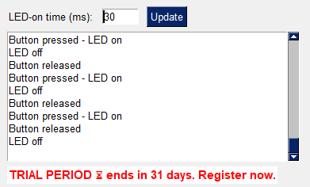
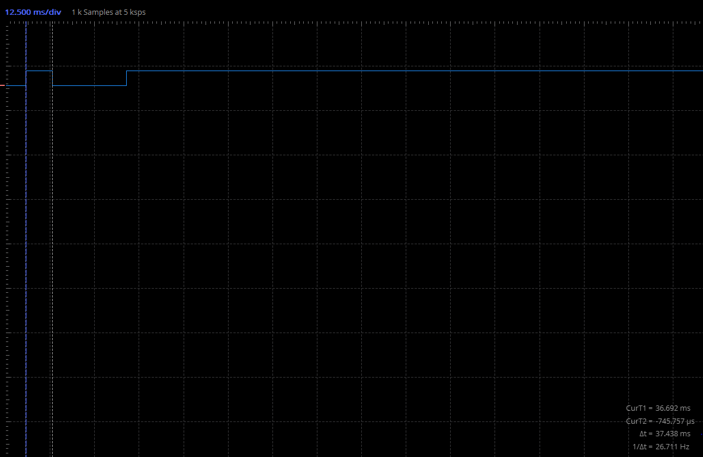

# Project8.1 - Two way communication between the computer and the Arduino board using firmataexpress

## Goals
1. Understand the firmataexpress package and its usage in actual project
2. Understand the use of jupyter notebooks for exploration

## Instructions
1. Install the firmataexpress package in the Arduino IDE. upload the firmataexpress sketch to the Arduino board.
2. Install the [pymata4 package](https://mryslab.github.io/pymata4/install_pymata4/) in the python environment - pip install pymata4 
3. follow along with the jupyter notebook.

**IMPORTANT!** the pymata4 package sometimes causes crashes. The computers reset when booting and all your code will be lost in this case. Therefore, **commit and push often**.

## Requirements

1. Develop a Python script that communicates with an Arduino device using the pymata4 library.
2. Set up a pin for digital input and monitor its changes.
3. React to button presses on the Arduino. When the button is pressed, perform an action (e.g., print a message, turn on an LED).
5. use threading.Timer (from the threading python package) to turn off the led. This will allow the script to perform other tasks while waiting for the button press. This version of the script should be named Reacting_button_press_pymata4_using_timer.py.
6. Add a Graphical User Interface (GUI) to the timer version of the script. The GUI should display the state of the button (pressed or not pressed) and any actions performed in response to the button press. plus, it should have a textbox input to accept different time intervals for the timer.
7. light the led for 30 ms. Measure in scopy the length of the led light a 5-10 times and measure the average and standard deviation - Mean ≈ 42.10, Standard Deviation ≈ 3.19
. Compare to previous arduino and non firmata python code.
8. Include comments explaining the functionality of each part of the code.
9. Write the script in a clean, organized, and efficient manner following good programming practices.


## Exercises
Paste a screenshot of the GUI here:

Paste a screenshot of the logic analyzer here that presents the time the LED is ON when pressing the button.

```
What is the difference between the two versions (with pymata4 and firmata and without) of the script? Which one was easier to code? Where was thread handling easier?

Answer: __________
The difference:
With the serial-plus-Arduino-sketch approach we wrote and uploaded our own C++ code that handled pin setup, button debouncing, timing, etc.
Using Pymata4 with StandardFirmataExpress we flashed a generic firmware once and then let Python configure pins, receive events through ready-made callbacks, and drive the LED; the Firmata library hides the binary protocol and spawns its own background thread, so we only added a simple threading.Timer for the LED-off delay.
The Firmata version shifts almost all logic to Python, needs far less code on the board, and simplifies threading on the PC side, while the custom-sketch version gives us tighter timing and full control but requires more code on both ends.

Which one was easier to code?
Pymata4 / FirmataExpress (less total code on both ends).
Where was thread handling easier?
Pymata4, thanks to built-in callbacks, though you trade some timing precision for convenience.


 
What can you say about the accuracy of the timing between the firmata version and your arduino code version?
which one is more accurate and why?
The Arduino-only sketch is more accurate. It uses MsTimer2, a hardware timer on the microcontroller, so the 30 ms pulse length varies by only a few hundred microseconds. The Firmata version relies on Python’s threading.Timer, USB latency, and the PC operating system scheduler, adding millisecond-level jitter.

What are the advantages and disadvantages of using the pymata4 package?

Answer: __________
Pymata4 pros:
No Arduino coding; set pins and callbacks from Python in minutes.
Built-in background thread delivers events, so you skip manual serial parsing.
Same script runs on any board with dFirmataExpress.

Pymata4 cons:
Timing is PC- and USB-dependent, so pulses jitter by milliseconds.
Board stops if the host PC disconnects, because logic lives in Python.